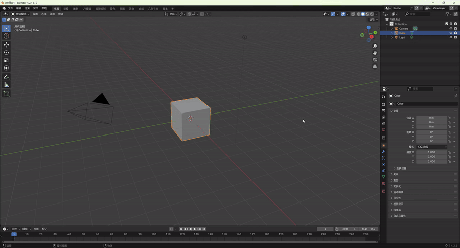
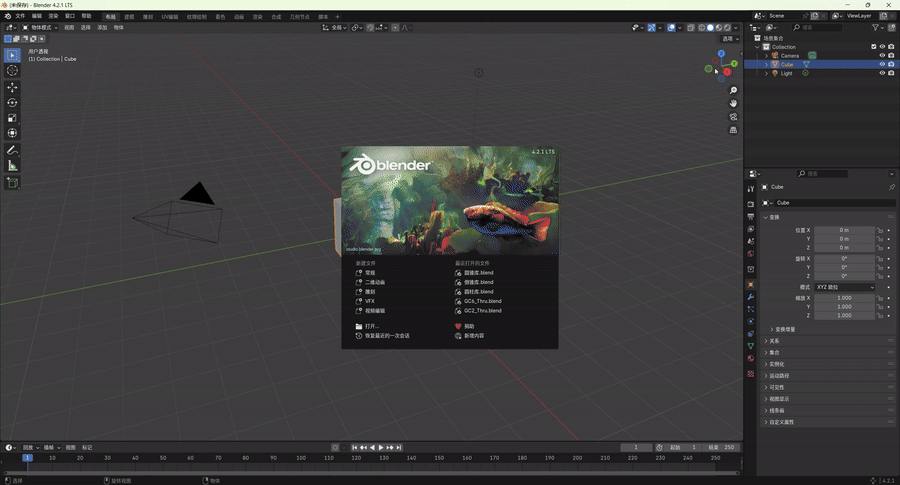
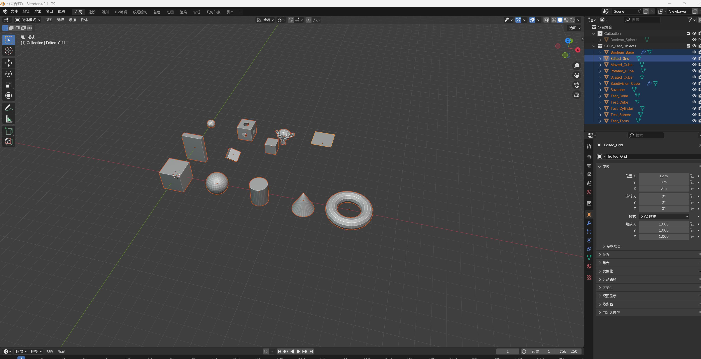
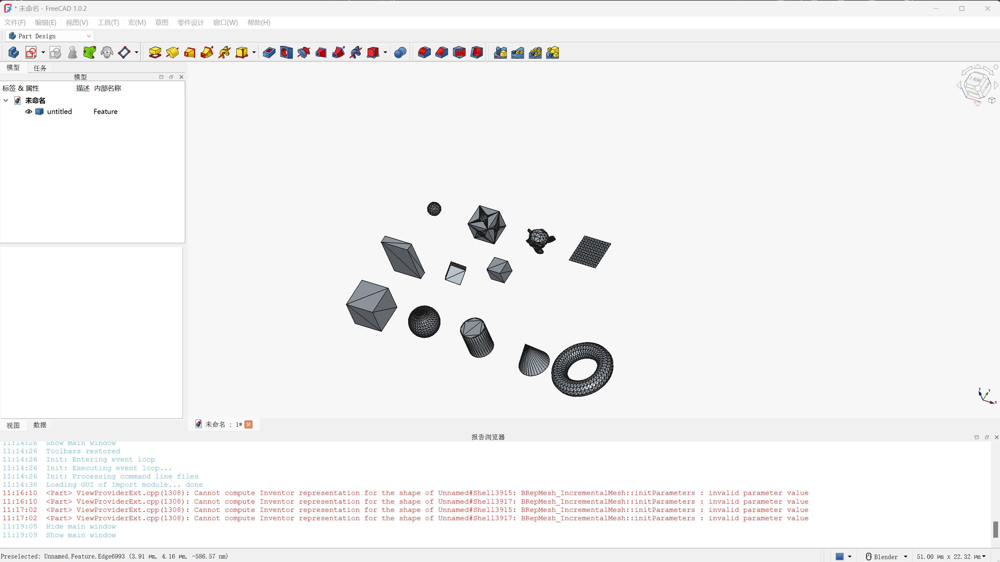
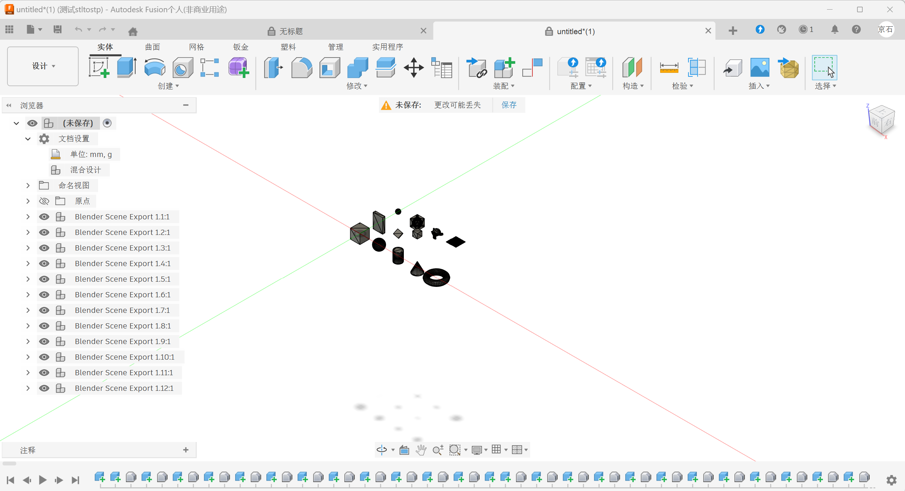

# 功能演示 (Examples)

## 参数化圆柱体 Gallery

blender2step 内置参数化圆柱体生成器，支持标准圆柱、锥度圆柱、倒角/圆角、通孔/盲孔/台阶孔等多种变体，
共生成 192 个测试用例，覆盖各种组合。

### Cylinder Gallery（标准圆柱）

标准圆柱、锥度圆柱、倒角圆柱、圆角圆柱、通孔圆柱等变体，
通过 `step_exporter/examples/create_cylinder_gallery.py` 脚本自动生成。


### Cone Gallery（锥形圆柱）

锥形圆柱体变体：标准锥、倒锥、台阶孔锥等，通过 `step_exporter/examples/create_cone_gallery.py` 生成。



### Inverted Cone Gallery（倒锥圆柱）

倒锥形圆柱体变体，通过 `step_exporter/examples/create_cone_gallery_inverted.py` 生成。



---

## STEP 导出验证

### Blender 导出面板

在 Blender 中通过 File ▸ Export ▸ STEP (Enhanced) 导出模型，
支持 Advanced BREP、Solid Creation、Geometry Fixing 等选项。



### FreeCAD 验证

导出的 STEP 文件在 FreeCAD 中打开，验证几何完整性。



### Fusion 360 验证

同样在 Autodesk Fusion 360 中兼容打开。



---

## 工作流程

```
Blender 建模 → 参数化圆柱生成 → STEP 导出 → FreeCAD / Fusion 360 验证 → 模具制造
```

所有 Gallery 案例均为自动生成的参数化模型，确保导出质量和一致性。
