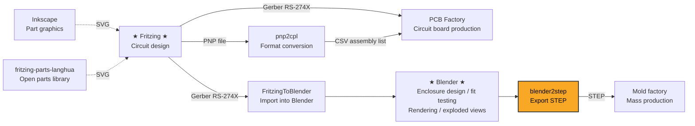

# blender2step
Blender STEP exporter based on OpenCASCADE.

This addon supports Blender 5.2 and was developed with AI assistance such as DeepSeek V4 Pro. It is designed for modeling parts in Blender for mold manufacturing.

📘 Chinese documentation: [README_zh.md](./README_zh.md)

> **blender2step** is a Blender 5.2 addon that exports 3D models to STEP format using OpenCASCADE 7.8.1. It is part of a simple gadget manufacturing toolchain: design enclosures in Blender, export STEP, and send to mold factories for mass production. Built primarily with AI assistance (DeepSeek V4 Pro).

## Toolchain

blender2step is one step in a simple electronics manufacturing toolchain:



| Stage | Project | Description |
|------|---------|-------------|
| Circuit design | [Fritzing](https://fritzing.org/) | Open-source circuit design software |
| Part graphics | [Inkscape](https://inkscape.org/) | Draw missing Fritzing SVG parts |
| Parts library | [fritzing-parts-langhua](https://github.com/langhua/fritzing-parts-langhua) | Open source component library |
| PCB manufacturing | — | Export Gerber RS-274X from Fritzing → factory produces double-sided boards |
| Format conversion | [pnp2cpl](https://github.com/langhua/pnp2cpl) | Convert PNP file to component name/location/rotation CSV |
| Enclosure design | [FritzingToBlender](https://github.com/langhua/FritzingToBlender) | Import Gerber RS-274X into Blender for enclosure modeling, fit testing, rendering, and exploded views |
| STEP export | **blender2step** ← you are here | Blender enclosure → STEP format → mold manufacturing |

## Development

### Recommended Tools

Recommended VS Code extensions for developing this addon:

| Extension | Use |
|-----------|-----|
| [Blender Development](https://marketplace.visualstudio.com/items?itemName=JacquesLucke.blender-development) | Debug Blender Python code in VS Code with breakpoints and variable inspection |
| [GitHub Copilot](https://marketplace.visualstudio.com/items?itemName=GitHub.copilot) | AI-assisted coding (this project was developed with DeepSeek V4 Pro and similar tools) |
| [CMake Tools](https://marketplace.visualstudio.com/items?itemName=ms-vscode.cmake-tools) | CMake project configuration and build integration |

> The Blender addon is linked to the git repository through a junction:
> `C:\Users\...\Blender Foundation\Blender\5.2\scripts\addons\step_exporter\` → `f:\git\blender2step\step_exporter\`
> Changes in the repository appear immediately in Blender without manual copying.

### Install Python 3.13

Because Blender 5.2 uses Python 3.13.x, install the same version of Python locally.

1. Open the Blender 5.2 Python directory and verify the Python version.
```shell
> cd "F:\Blender Foundation\Blender 5.2\5.2\python\bin"
> .\python.exe --version
Python 3.13.13
```
2. Visit https://www.python.org/downloads/
3. Download the Windows installer for Python 3.13 (64-bit) and install it.

### Build Python 3.13 on Windows 11 with Visual Studio Community 2022

Note: This is only necessary if you want to debug the Python code.

1. Visit the source archive at https://www.python.org/ftp/python/3.13.13/
2. Download Python-3.13.13.tar.xz and extract it.
3. Open a terminal, cd into Python-3.13.13\PCbuild, and run .\get_externals.bat.
4. Open Python-3.13.13\PCbuild\pcbuild.sln with Visual Studio Community 2022, choose Debug|x64, and build the solution.
5. Copy python313_d.lib from Python-3.13.13\PCbuild\amd64\ to the installed Python 3.13 libs folder, for example C:\Python313\libs.

### Build OpenCASCADE 7.8.1 on Windows 11 with vcpkg

1. Check the OpenCASCADE version shown by FreeCAD:
Open FreeCAD, click Help → About FreeCAD, and check the OpenCASCADE version.


2. Clone vcpkg:
```
cd F:\git\
git clone https://github.com/microsoft/vcpkg.git
cd vcpkg
```

3. Bootstrap vcpkg:
```
.\bootstrap-vcpkg.bat
```

4. Integrate vcpkg with Windows:
```
.\vcpkg integrate install
```

5. Install OpenCASCADE 7.8.1:
```
.\vcpkg install opencascade:x64-windows@7.8.1
```

Remove-Item -Recurse -Force F:\git\vcpkg\buildtrees\opencascade\x64-windows-dbg\win64\vc14\bind\TKGeomAlgo.dll -ErrorAction SilentlyContinue
Remove-Item -Recurse -Force F:\git\vcpkg\buildtrees\opencascade\x64-windows-dbg\ -ErrorAction SilentlyContinue

### Build blender2step with Visual Studio Community 2022

See [BUILD.md](./BUILD.md) for details.

## Project Structure

```
blender2step/
├── step_exporter/              # Blender addon (Python)
│   ├── __init__.py             # Addon entry, C++ loader, register/unregister
│   ├── core/                   # Core utilities: i18n, mesh_data, utils
│   ├── analysis/               # Geometry analysis: cylinders, cones, shells
│   ├── export/                 # Export modules: sync / staged export
│   ├── ui/                     # UI panels, operators, parametric cylinders
│   ├── examples/               # Example scripts (Gallery generation)
│   ├── tests/                  # Blender test scripts
│   └── lib/                    # _step_exporter.pyd output folder
├── src/                        # C++ source (OpenCASCADE)
│   ├── curve/                  # Curve utilities (Bezier, NURBS, Poly)
│   ├── shape/                  # Shape creation, repair, fillets
│   ├── export/                 # STEP export core (enhanced, incremental)
│   └── step_converter.cpp      # Python ↔ C++ bridge
├── include/                    # C++ headers
├── scripts/                    # Build helper scripts
├── tests/                      # Pure Python tests (no Blender required)
├── docs/                       # Documentation images
├── .github/workflows/ci.yml    # CI configuration
├── CMakeLists.txt              # Local build
├── CMakeLists.ci.txt           # CI build
├── BUILD.md                    # Build instructions
└── TESTS.md                    # Test documentation
```

## Testing

See [TESTS.md](./TESTS.md) for full test documentation.

See [TEST_CASES.md](./TEST_CASES.md) for the regression test case matrix.

### Quick verification

```powershell
# 1. Build environment check
python check_build.py

# 2. Verify .pyd build
python verify_build.py

# 3. Unit tests (no Blender required)
python -m pytest step_exporter/tests/test_core_utils.py step_exporter/tests/test_i18n.py -v

# 4. Full CI-style test (requires Blender)
& "f:\Program Files\Blender Foundation\Blender 5.2\blender.exe" --background --python ci_test_runner.py
```

### CI

GitHub Actions run automatically on push/PR to `main` (.github/workflows/ci.yml):

- **build**: compile the C++ .pyd (using OCCT 7.8.1)
- **test**: run pytest unit tests inside Blender
- **lint**: `ruff check` code quality
- **integration**: full integration test (create cylinder → export STEP → verify)

### Measurement units

**Blender scene settings:**
    Scene Properties → Units
    Unit System  → Metric
    Unit Scale   → 0.001
    Length       → Millimeters

    That means:
    Unit Scale = 0.001 → 1 BU = 1 mm
    Length = Millimeters

**FreeCAD:** millimeter

**Coordinate data flow:**
    Blender mesh vertex raw values (BU) → with current Unit Scale interpreted as mm
    Python reads vertex.co (after matrix_world) → raw BU values → passed directly as mm into C++
    Do not multiply by 1000 unless your Unit Scale is 1 and you treat BU as meters.

STEP file unit declaration: MILLIMETER
FreeCAD open: millimeters (consistent ✓)

### Model sizing

Many Blender mesh models are not fully supported by OpenCASCADE. If you encounter size inconsistencies, trust the OpenCASCADE model size so the STEP file can be generated correctly for mold manufacturing.

## Examples

See [EXAMPLES.md](./EXAMPLES.md) for additional demo content.

There are 3 galleries: cylinder, cone and inverted cone, generated by Python scripts.

### Cylinder Gallery

The Cylinder Gallery contains 192 cylinders. The first 8 are original shapes; the rest are derived from those originals.

Here is a gif showing how the cylinder gallery is generated:

<details>
<summary>▶ Click to play demo</summary>


</details>

### Cone Gallery

The Cone Gallery contains variations of conical cylinders (standard cones, inverted cones, stepped holes, etc.), generated by `step_exporter/examples/create_cone_gallery.py`.

### Inverted Cone Gallery

The Inverted Cone Gallery contains inverted-cone variations generated by `step_exporter/examples/create_cone_gallery_inverted.py`.

## Design Rules

See [DESIGN.md](./DESIGN.md) for the project's core design rules and conventions, including:

- unit and coordinate conversion rules (Unit Scale, Z=0 rule)
- cylinder compensation architecture (pre-compensation in Python, no compensation in C++)
- bottom fillet construction guidelines
- Blender boolean solver selection
- rim formula and stepped-cone hole geometry

## Coordinate System

Blender and FreeCAD both use the same right-handed Cartesian coordinate system: **Z-up, X-right, Y-back**. The STEP geometry is 1:1 compatible.

If you want FreeCAD to display the model with a view direction that looks more like Blender's, enable the new **Mirror X Axis** export option. This mirrors the exported STEP geometry along the X axis (X → -X) for better visual correspondence between the two applications while preserving the underlying model shape.

If the model appears rotated or offset when opened in FreeCAD:

| Symptom | Fix in FreeCAD |
|---|---|
| Model at wrong angle | Use **Placement → Rotation** (rotate around X/Y/Z), never mirror with Scale = -1 |
| Model far from origin | Use **Placement → Position** to translate back, or apply object location in Blender before export |
| Model too large or too small | Enable **Edit → Preferences → Import-Export → STEP → Scale to millimeters** |

View directions may appear mirrored between the two applications due to different default view naming conventions — this is a display convention, not a coordinate mismatch. Rotate the view in FreeCAD to match Blender's perspective.
