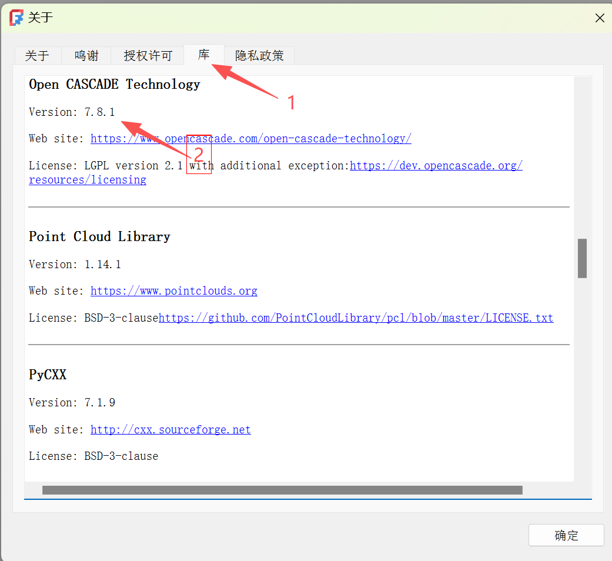

# blender2step
Blender step exporter based on OpenCASCADE.

本模块仅支持Blender 4.2.1，主要由DeepSeek V4 Pro等AI模型生成。


## Development


### Install Python 3.11.7

As the python version in Blender 4.2.1 is 3.11.7, you need to install the same version of Python.

1. 进入Blender 4.2.1目录，确认Python版本。
```shell
> cd "F:\Blender Foundation\Blender Foundation\Blender 4.2\4.2\python\bin"
> .\python.exe --version
Python 3.11.7
```

2. Visit https://www.python.org/downloads/release/python-3117/

3. Download "Windows installer (64-bit)" and install it.


### Build Python 3.11.7 on Windows 11 with Visual Studio Community 2022

As I didn't have python311_d.lib installed, I built it from source.

1. Visit the source code from https://www.python.org/ftp/python/3.11.7/

2. Download Python-3.11.7.tar.xz and extract it.

3. Open a terminal, cd \Python-3.11.7.tar\Python-3.11.7\PCbuild, run .\get_externals.bat:

```
PS F:\Python-3.11.7.tar\Python-3.11.7\PCbuild> .\get_externals.bat
Using "F:\Python-3.11.7.tar\Python-3.11.7\PCbuild\\..\externals\pythonx86\tools\python.exe" (found in externals directory)
Fetching external libraries...
Fetching bzip2-1.0.8...
Fetching sqlite-3.42.0.0...
Fetching xz-5.2.5...
Fetching zlib-1.2.13...
Fetching external binaries...
Fetching libffi-3.4.4...
Fetching openssl-bin-1.1.1u...
Fetching tcltk-8.6.12.1...
Finished.
```

4. Open Python-3.11.7.tar\Python-3.11.7\PCbuild\pcbuild.sln with Visual Studio Community 2022, run Debug|x64, build the solution.

5. Copy python311_d.lib from Python-3.11.7.tar\Python-3.11.7\PCbuild\amd64\ to the installed python 3.11.7 lib folder, e.g. C:\Python311\libs.

### Build OpenCASCADE 7.8.1 on Windows 11 with vcpkg

1. Check FreeCAD OpenCASCADE verion:

Open FreeCAD, click Help->About FreeCAD, check the OpenCASCADE version.




2. Clone vcpkg:
```
cd F:\git\
git clone https://github.com/microsoft/vcpkg.git
cd vcpkg
```

3. Bootstrap vcpkg:
```
.\bootstrap-vcpkg.bat
```

4. Integrate vcpkg with Windows:
```
.\vcpkg integrate install
```

5. Install OpenCASCADE 7.8.1:
```
.\vcpkg install opencascade:x64-windows@7.8.1
```

Remove-Item -Recurse -Force F:\git\vcpkg\buildtrees\opencascade\x64-windows-dbg\win64\vc14\bind\TKGeomAlgo.dll -ErrorAction SilentlyContinue
Remove-Item -Recurse -Force F:\git\vcpkg\buildtrees\opencascade\x64-windows-dbg\ -ErrorAction SilentlyContinue

### Build blender2step with Visual Studio Community 2022

1. 


### Auto Test

1. Export a step file from Blender and screenshot it in FreeCAD.
blender --background --python .\step_exporter\test\run_test.py -- --test-number 29

2. Screenshot it in FreeCAD only.
blender --background --python .\step_exporter\test\run_test.py -- --test-number 29 --skip-export


### Messure Unit

**Blender 场景设置:**
    Scene Properties（场景属性）▸ Units
    Unit System  → Metric
    Unit Scale   → 0.001
    Length       → Millimeters

**FreeCAD:** millimeter

**代码单位约定 (Code Unit Convention):**

| 组件 | 单位 | 说明 |
|------|------|------|
| Blender 原生 (mesh 数据) | 米 (m) | Blender 内部始终使用米 |
| 对象自定义属性 (Custom Properties) | 毫米 (mm) | 存储时 ×1000，读取时 ×0.001 |
| C++ 导出函数 (全部) | 毫米 (mm) | 分析返回 ×S (S=1000) |
| STEP 文件输出 | 毫米 (mm) | 行业标准 |

> 内外一致使用毫米：Python 分析层将 Blender 原生米单位 ×S 缩放为毫米后传给 C++，
> C++ 直接使用毫米值创建几何体，STEP 文件标注 MILLIMETER。
