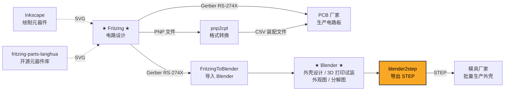
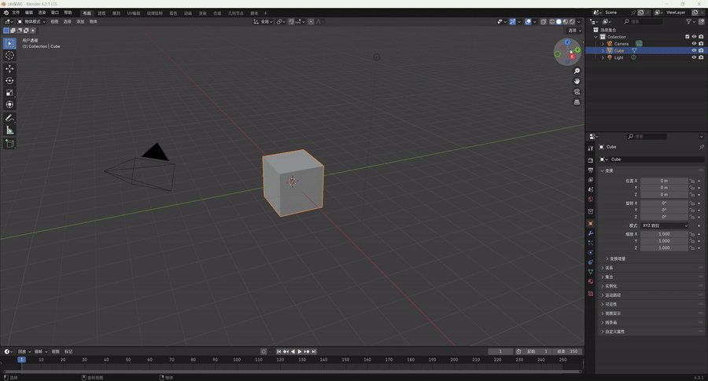

# blender2step
Blender step exporter based on OpenCASCADE.

本模块支持Blender 4.2+ / 5.x，主要由DeepSeek V4 Pro等AI模型生成。

本模块是为了在Blender中设计模型，用于模具制造。

> **blender2step** is a Blender 4.2+ / 5.x addon that exports 3D models to STEP format using OpenCASCADE 7.8.1. It is part of a simple gadget manufacturing toolchain: design enclosures in Blender, export STEP, and send to mold factories for mass production. Built primarily with AI assistance (DeepSeek V4 Pro).

## Toolchain

blender2step 是简单电子产品制造工具链的一环：



| 环节 | 项目 | 说明 |
|------|------|------|
| 电路设计 | [Fritzing](https://fritzing.org/) | 开源电路设计软件 |
| 元器件绘制 | [Inkscape](https://inkscape.org/) | 绘制 Fritzing 中缺失的元器件 SVG |
| 元器件库 | [fritzing-parts-langhua](https://github.com/langhua/fritzing-parts-langhua) | 开源元器件库 |
| PCB 生产 | — | Fritzing 导出 Gerber RS-274X → PCB 厂家生产双层板 |
| 格式转换 | [pnp2cpl](https://github.com/langhua/pnp2cpl) | PNP 文件 → 元器件名称/位置/角度的 CSV 装配文件 |
| 外壳设计 | [FritzingToBlender](https://github.com/langhua/FritzingToBlender) | Gerber RS-274X 导入 Blender，外壳建模、外观图、分解图、3D 打印试装 |
| STEP 导出 | **blender2step** ← 你在这里 | Blender 外壳 → STEP 格式 → 模具制造 |

## Development

### Recommended Tools

开发本模块推荐使用以下 VS Code 插件：

| 插件 | 用途 |
|------|------|
| [Blender Development](https://marketplace.visualstudio.com/items?itemName=JacquesLucke.blender-development) | 在 VS Code 中调试 Blender Python 代码，支持断点、变量查看 |
| [GitHub Copilot](https://marketplace.visualstudio.com/items?itemName=GitHub.copilot) | AI 辅助编码（本项目主要由 DeepSeek V4 Pro 等 AI 模型生成） |
| [CMake Tools](https://marketplace.visualstudio.com/items?itemName=ms-vscode.cmake-tools) | CMake 项目配置和编译集成 |

> Blender 插件通过 **junction** 链接到 git 仓库：
> `C:\Users\...\Blender Foundation\Blender\5.2\scripts\addons\step_exporter\` → `f:\git\blender2step\step_exporter\`
> 修改仓库文件会立即反映在 Blender 中，无需手动复制。

### Install Python 3.13

As the python version in Blender 5.2 is 3.13.x, you need to install the same version of Python.

1. 进入Blender 5.2目录，确认Python版本。
```shell
> cd "F:\Blender Foundation\Blender 5.2\5.2\python\bin"
> .\python.exe --version
Python 3.13.13
```

2. Visit https://www.python.org/downloads/

3. Download "Windows installer (64-bit)" for Python 3.13 and install it.


### Build Python 3.13 on Windows 11 with Visual Studio Community 2022

Note: This is not necessary, only if you want to debug the python code.

1. Visit the source code from https://www.python.org/ftp/python/3.13.13/

2. Download Python-3.13.13.tar.xz and extract it.

3. Open a terminal, cd Python-3.13.13\PCbuild, run .\get_externals.bat.

4. Open Python-3.13.13\PCbuild\pcbuild.sln with Visual Studio Community 2022, run Debug|x64, build the solution.

5. Copy python313_d.lib from Python-3.13.13\PCbuild\amd64\ to the installed python 3.13 lib folder, e.g. C:\Python313\libs.

### Build OpenCASCADE 7.8.1 on Windows 11 with vcpkg

1. Check FreeCAD OpenCASCADE verion:

Open FreeCAD, click Help->About FreeCAD, check the OpenCASCADE version.


2. Clone vcpkg:
```
cd F:\git\
git clone https://github.com/microsoft/vcpkg.git
cd vcpkg
```

3. Bootstrap vcpkg:
```
.\bootstrap-vcpkg.bat
```

4. Integrate vcpkg with Windows:
```
.\vcpkg integrate install
```

5. Install OpenCASCADE 7.8.1:
```
.\vcpkg install opencascade:x64-windows@7.8.1
```

Remove-Item -Recurse -Force F:\git\vcpkg\buildtrees\opencascade\x64-windows-dbg\win64\vc14\bind\TKGeomAlgo.dll -ErrorAction SilentlyContinue
Remove-Item -Recurse -Force F:\git\vcpkg\buildtrees\opencascade\x64-windows-dbg\ -ErrorAction SilentlyContinue

### Build blender2step with Visual Studio Community 2022

See [BUILD.md](./BUILD.md) for details.


## Project Structure

```
blender2step/
├── step_exporter/              # Blender 插件（Python）
│   ├── __init__.py             # 插件入口，C++ 加载，注册/注销
│   ├── core/                   # 核心工具：i18n, mesh_data, utils
│   ├── analysis/               # 几何分析：圆柱/圆锥/壳体识别
│   ├── export/                 # 导出模块：同步/分阶段导出
│   ├── ui/                     # UI 面板、操作符、参数化圆柱
│   ├── examples/               # 示例脚本（Gallery 生成）
│   ├── tests/                  # Blender 内测试脚本
│   └── lib/                    # _step_exporter.pyd 目标目录
├── src/                        # C++ 源码（OpenCASCADE）
│   ├── curve/                  # 曲线函数（Bezier, NURBS, Poly）
│   ├── shape/                  # 形状创建/修复/圆角
│   ├── export/                 # STEP 导出核心（enhanced, incremental）
│   └── step_converter.cpp      # Python ↔ C++ 桥接
├── include/                    # C++ 头文件
├── scripts/                    # 构建辅助脚本
├── tests/                      # 纯 Python 测试（无需 Blender）
├── docs/                       # 文档图片
├── .github/workflows/ci.yml    # CI 配置
├── CMakeLists.txt              # 本地构建
├── CMakeLists.ci.txt           # CI 构建
├── BUILD.md                    # 构建说明
└── TESTS.md                    # 测试文档
```

## Testing

完整的测试文档请参见 [TESTS.md](./TESTS.md)。

回归测试用例矩阵请参见 [TEST_CASES.md](./TEST_CASES.md)。

### 快速验证

```powershell
# 1. 构建环境检查
python check_build.py

# 2. 验证 .pyd 编译
python verify_build.py

# 3. 单元测试（无需 Blender）
python -m pytest step_exporter/tests/test_core_utils.py step_exporter/tests/test_i18n.py -v

# 4. 完整 CI 测试（需 Blender）
& "f:\Program Files\Blender Foundation\Blender 5.2\blender.exe" --background --python ci_test_runner.py
```

### CI

GitHub Actions 在 Push/PR 到 `main` 分支时自动运行（配置：`.github/workflows/ci.yml`）：

- **build**: 编译 C++ .pyd（使用 OCCT 7.8.1 预编译包）
- **test**: 在 Blender 中运行 pytest 单元测试
- **lint**: `ruff check` 代码质量检查
- **integration**: 完整集成测试（创建圆柱 → 导出 STEP → 验证）


### Measure Unit

**Blender 场景设置:**
    Scene Properties（场景属性）▸ Units
    Unit System  → Metric
    Unit Scale   → 0.001
    Length       → Millimeters

    即：
    Unit Scale  = 0.001  →  1 BU = 1 mm
    Length      = Millimeters


**FreeCAD:** millimeter

**坐标数据流:**
    Blender mesh 顶点裸值（BU）→ 在当前 Unit Scale 下数值上 = 毫米
    Python 取 vertex.co（经 matrix_world 变换后）→ 裸 BU 值 → 直接作为 mm 传入 C++
    不要额外 ×1000（×1000 只在 Unit Scale=1 / 把 BU 当米解释时才需要）

    STEP 文件单位声明: MILLIMETER
    FreeCAD 打开: 毫米（一致 ✓）


### 模型尺寸

Blender很多mesh模型，OpenCASCADE还不能很好支持，遇到模型尺寸不一致的情况，以OpenCASCADE模型尺寸为准，以便能生成准确的STEP文件，用于模具制造。


## Examples

更多功能演示截图和说明请参见 [EXAMPLES.md](./EXAMPLES.md)。

There are 3 galleries: cylinder, cone and inverted cone, generated by Python scripts.

### Cylinder Gallery

Cylinder Gallery has 192 cylinders, the first 8 are original, the others are derived from the original ones.

Here is a gif shows how the cylinder gallery is generated:

<details>
<summary>▶ 点击播放演示</summary>



</details>

### Cone Gallery

Cone Gallery 包含各种锥形圆柱体变体（标准锥、倒锥、台阶孔锥等），通过 `step_exporter/examples/create_cone_gallery.py` 生成。

### Inverted Cone Gallery

Inverted Cone Gallery 包含倒锥形圆柱体变体，通过 `step_exporter/examples/create_cone_gallery_inverted.py` 生成。

## Design Rules

项目的核心设计规则和约定请参见 [DESIGN.md](./DESIGN.md)，包括：

- 单位与坐标转换规则（Unit Scale, Z=0 规则）
- 圆柱体补偿架构（Python 预补偿，C++ 不补偿）
- 底部圆角手动构建规范
- Blender Boolean 求解器选择
- Rim 公式与锥形台阶孔几何
