# blender2step
基于 OpenCASCADE 的 Blender STEP 导出器。

本插件支持 Blender 5.2，并借助 DeepSeek V4 Pro 等 AI 工具辅助开发。它用于在 Blender 中建模外壳，并导出 STEP 文件以支持模具制造。

📘 English documentation: [README.md](./README.md)

> **blender2step** 是一个 Blender 5.2 插件，使用 OpenCASCADE 7.8.1 将 3D 模型导出为 STEP 格式。它是一个简单的小型电子产品制造工具链的一部分：在 Blender 中设计外壳、导出 STEP，并发送给模具厂家用于量产。主要由 AI 辅助开发（DeepSeek V4 Pro）。

## 工具链

blender2step 是简单电子产品制造工具链中的一步：



| 阶段 | 项目 | 说明 |
|------|------|------|
| 电路设计 | [Fritzing](https://fritzing.org/) | 开源电路设计软件 |
| 元件图形 | [Inkscape](https://inkscape.org/) | 绘制 Fritzing 中缺失的 SVG 元件 |
| 元件库 | [fritzing-parts-langhua](https://github.com/langhua/fritzing-parts-langhua) | 开源元件库 |
| PCB 制造 | — | 从 Fritzing 导出 Gerber RS-274X → 厂商生产双面板 |
| 格式转换 | [pnp2cpl](https://github.com/langhua/pnp2cpl) | 将 PNP 文件转换为元件名称/位置/旋转的 CSV |
| 外壳设计 | [FritzingToBlender](https://github.com/langhua/FritzingToBlender) | 将 Gerber RS-274X 导入 Blender，用于外壳建模、试装、渲染和分解图 |
| STEP 导出 | **blender2step** ← 你在这里 | Blender 外壳 → STEP 格式 → 模具制造 |

## 开发

### 推荐工具

开发本插件推荐使用以下 VS Code 插件：

| 插件 | 用途 |
|------|------|
| [Blender Development](https://marketplace.visualstudio.com/items?itemName=JacquesLucke.blender-development) | 在 VS Code 中调试 Blender Python 代码，支持断点和变量查看 |
| [GitHub Copilot](https://marketplace.visualstudio.com/items?itemName=GitHub.copilot) | AI 辅助编码（本项目参考 DeepSeek V4 Pro 等工具开发） |
| [CMake Tools](https://marketplace.visualstudio.com/items?itemName=ms-vscode.cmake-tools) | CMake 项目配置和构建集成 |

> Blender 插件通过交叉链接到 git 仓库：
> `C:\Users\...\Blender Foundation\Blender\5.2\scripts\addons\step_exporter\` → `f:\git\blender2step\step_exporter\`
> 仓库中的修改会立即在 Blender 中生效，无需手动复制。

### 安装 Python 3.13

由于 Blender 5.2 使用 Python 3.13.x，请安装相同版本的 Python。

1. 打开 Blender 5.2 的 Python 目录并确认 Python 版本。
```shell
> cd "F:\Blender Foundation\Blender 5.2\5.2\python\bin"
> .\python.exe --version
Python 3.13.13
```
2. 访问 https://www.python.org/downloads/
3. 下载适用于 Windows 的 Python 3.13 64 位安装程序并安装。

### 在 Windows 11 上使用 Visual Studio Community 2022 构建 Python 3.13

注意：仅在你希望调试 Python 代码时才需要执行这一步。

1. 从 https://www.python.org/ftp/python/3.13.13/ 下载源代码。
2. 下载 Python-3.13.13.tar.xz 并解压。
3. 打开终端，进入 Python-3.13.13\PCbuild，运行 .\get_externals.bat。
4. 使用 Visual Studio Community 2022 打开 Python-3.13.13\PCbuild\pcbuild.sln，选择 Debug|x64 并构建。
5. 将 python313_d.lib 从 Python-3.13.13\PCbuild\amd64\ 复制到已安装 Python 3.13 的 libs 文件夹，例如 C:\Python313\libs。

### 在 Windows 11 上使用 vcpkg 构建 OpenCASCADE 7.8.1

1. 检查 FreeCAD 中显示的 OpenCASCADE 版本：
打开 FreeCAD，点击 Help → About FreeCAD，查看 OpenCASCADE 版本。


2. 克隆 vcpkg：
```
cd F:\git\
git clone https://github.com/microsoft/vcpkg.git
cd vcpkg
```

3. 引导 vcpkg：
```
.\bootstrap-vcpkg.bat
```

4. 将 vcpkg 集成到 Windows：
```
.\vcpkg integrate install
```

5. 安装 OpenCASCADE 7.8.1：
```
.\vcpkg install opencascade:x64-windows@7.8.1
```

Remove-Item -Recurse -Force F:\git\vcpkg\buildtrees\opencascade\x64-windows-dbg\win64\vc14\bind\TKGeomAlgo.dll -ErrorAction SilentlyContinue
Remove-Item -Recurse -Force F:\git\vcpkg\buildtrees\opencascade\x64-windows-dbg\ -ErrorAction SilentlyContinue

### 使用 Visual Studio Community 2022 构建 blender2step

详细说明请参见 [BUILD.md](./BUILD.md)。

## 项目结构

```
blender2step/
├── step_exporter/              # Blender 插件（Python）
│   ├── __init__.py             # 插件入口，C++ 加载，注册/注销
│   ├── core/                   # 核心工具：i18n、mesh_data、utils
│   ├── analysis/               # 几何分析：圆柱、圆锥、壳体
│   ├── export/                 # 导出模块：同步/分阶段导出
│   ├── ui/                     # UI 面板、操作符、参数化圆柱
│   ├── examples/               # 示例脚本（Gallery 生成）
│   ├── tests/                  # Blender 内测试脚本
│   └── lib/                    # _step_exporter.pyd 输出目录
├── src/                        # C++ 源码（OpenCASCADE）
│   ├── curve/                  # 曲线工具（Bezier、NURBS、Poly）
│   ├── shape/                  # 形状创建、修复、圆角
│   ├── export/                 # STEP 导出核心（增强、增量）
│   └── step_converter.cpp      # Python ↔ C++ 桥接
├── include/                    # C++ 头文件
├── scripts/                    # 构建辅助脚本
├── tests/                      # 纯 Python 测试（无需 Blender）
├── docs/                       # 文档图片
├── .github/workflows/ci.yml    # CI 配置
├── CMakeLists.txt              # 本地构建
├── CMakeLists.ci.txt           # CI 构建
├── BUILD.md                    # 构建说明
└── TESTS.md                    # 测试文档
```

## 测试

完整测试文档请参见 [TESTS.md](./TESTS.md)。

回归测试用例矩阵请参见 [TEST_CASES.md](./TEST_CASES.md)。

### 快速验证

```powershell
# 1. 构建环境检查
python check_build.py

# 2. 验证 .pyd 构建
python verify_build.py

# 3. 单元测试（无需 Blender）
python -m pytest step_exporter/tests/test_core_utils.py step_exporter/tests/test_i18n.py -v

# 4. 完整 CI 风格测试（需要 Blender）
& "f:\Program Files\Blender Foundation\Blender 5.2\blender.exe" --background --python ci_test_runner.py
```

### CI

GitHub Actions 在推送/PR 到 `main` 时自动运行（配置：.github/workflows/ci.yml）：

- **build**：编译 C++ .pyd（使用 OCCT 7.8.1）
- **test**：在 Blender 中运行 pytest 单元测试
- **lint**：`ruff check` 代码质量
- **integration**：完整集成测试（创建圆柱 → 导出 STEP → 验证）

### 测量单位

**Blender 场景设置：**
    Scene Properties → Units
    Unit System  → Metric
    Unit Scale   → 0.001
    Length       → Millimeters

    这意味着：
    Unit Scale = 0.001 → 1 BU = 1 mm
    Length = Millimeters

**FreeCAD：** millimeter

**坐标数据流：**
    Blender mesh 顶点裸值（BU）→ 在当前 Unit Scale 下解释为 mm
    Python 读取 vertex.co（matrix_world 之后）→ 裸 BU 值 → 直接作为 mm 传入 C++
    除非 Unit Scale=1 并且将 BU 视为米，否则不要乘以 1000。

STEP 文件单位声明：MILLIMETER
FreeCAD 打开：毫米（保持一致 ✓）

### 模型尺寸

许多 Blender mesh 模型尚未完全被 OpenCASCADE 支持。若出现尺寸不一致，请以 OpenCASCADE 模型尺寸为准，以便生成准确的 STEP 文件用于模具制造。

## 示例

更多演示内容请参见 [EXAMPLES.md](./EXAMPLES.md)。

共有 3 个画廊：圆柱、圆锥和倒锥，由 Python 脚本生成。

### 圆柱画廊

圆柱画廊包含 192 个圆柱体。前 8 个为原始形状，其余由原始形状派生。

下面的 gif 显示了圆柱画廊的生成过程：

<details>
<summary>▶ 点击查看演示</summary>


</details>

### 锥体画廊

锥体画廊包含各种锥形圆柱体变体（标准锥、倒锥、台阶孔等），由 `step_exporter/examples/create_cone_gallery.py` 生成。

### 倒锥画廊

倒锥画廊包含倒锥变体，由 `step_exporter/examples/create_cone_gallery_inverted.py` 生成。

## 设计规则

项目的核心设计规则和约定请参见 [DESIGN.md](./DESIGN.md)，包括：

- 单位与坐标转换规则（Unit Scale、Z=0 规则）
- 圆柱补偿架构（Python 预补偿，C++ 不补偿）
- 底部圆角构建规范
- Blender 布尔求解器选择
- Rim 公式与台阶锥孔几何

## 坐标系

Blender 和 FreeCAD 都使用相同的右手笛卡尔坐标系：**Z 向上，X 向右，Y 向后**。STEP 几何与之 1:1 兼容。

如果你希望 FreeCAD 的显示视图更接近 Blender，请启用新的 **镜像 X 轴** 导出选项。该选项将导出的 STEP 几何沿 X 轴镜像（X → -X），以获得更一致的显示效果，同时保持模型形状不变。

如果在 FreeCAD 中打开模型时出现旋转或偏移：

| 现象 | FreeCAD 中的修复 |
|---|---|
| 模型角度不对 | 使用 **Placement → Rotation** 进行旋转（绕 X/Y/Z），避免使用 Scale = -1 镜像 |
| 模型远离原点 | 使用 **Placement → Position** 平移回原点，或在导出前在 Blender 中应用位置 |
| 模型过大或过小 | 启用 **Edit → Preferences → Import-Export → STEP → Scale to millimeters** |

由于两个应用默认视图命名不同，视图方向可能看起来是镜像的——这是显示约定，不是坐标不匹配。请在 FreeCAD 中旋转视图以匹配 Blender 的透视。
